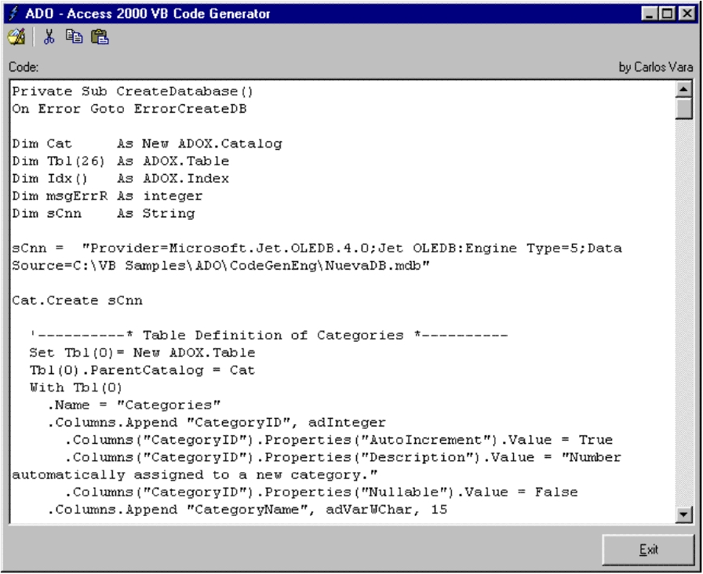



## A D O \- Access 2000 VB Code Generator

### Description

I catalogue this program like an utilitiy

this utility generate a function that you can use inside your apps to create an Access 2000 Database With ADO Reviewed Version 1.1.0!

Vote Please!

Just copy and paste the code generated to new VB project and two references

Microsoft ActiveX Data Objects 2.5 Library

Microsoft ADO Ext. 2.5 for DDL an Security
 
### More Info
 

             |
---                |---
**Submitted On**   |2001-12-04 16:28:18
**By**             |[Carlos Vara](https://github.com/Planet-Source-Code/PSCIndex/blob/master/ByAuthor/carlos-vara.md)
**Level**          |Advanced
**User Rating**    |4.7 (147 globes from 31 users)
**Compatibility**  |VB 5\.0, VB 6\.0
**Category**       |[Databases/ Data Access/ DAO/ ADO](https://github.com/Planet-Source-Code/PSCIndex/blob/master/ByCategory/databases-data-access-dao-ado__1-6.md)
**World**          |[Visual Basic](https://github.com/Planet-Source-Code/PSCIndex/blob/master/ByWorld/visual-basic.md)
**Archive File**   |[A\_D\_O\_\-\_Ac485981142002\.zip](https://github.com/Planet-Source-Code/carlos-vara-a-d-o-access-2000-vb-code-generator__1-30389/archive/master.zip)

